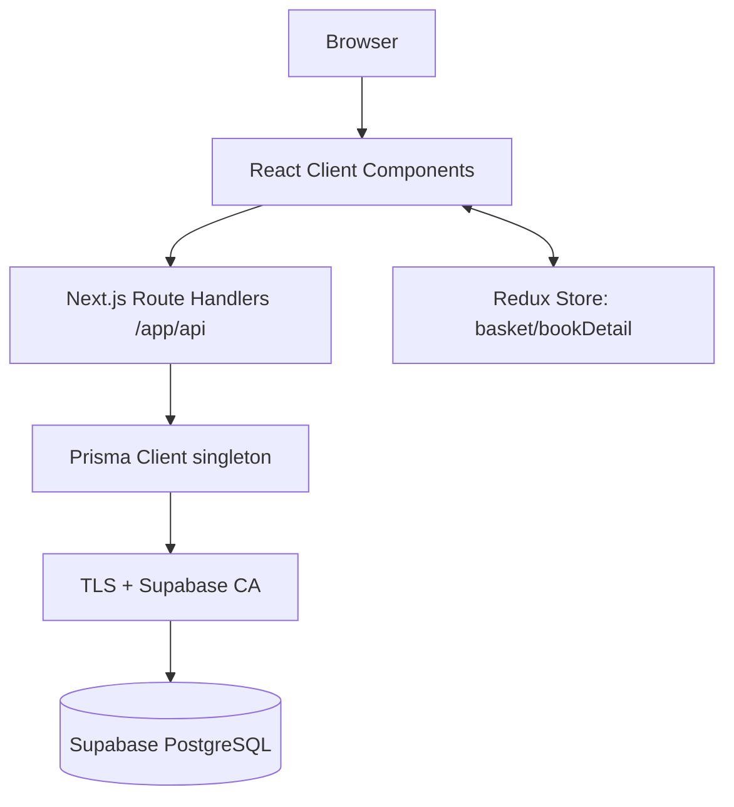

# สถาปัตยกรรมระบบ

## Authentication Boundary

- `middleware.ts` เรียก `lib/supabase/middleware.ts` เพื่อ verify/refresh Supabase Auth claims และส่ง cookie ใหม่กลับ response
- `lib/supabase/client.ts` ใช้ใน Browser Components; `lib/supabase/server.ts` ใช้ใน Server Components, Actions และ Route Handlers
- `lib/auth/current-user.ts` ยืนยัน user กับ Supabase Auth และค้นหา Employee ด้วย `authUserId`
- Session refresh มีแล้ว แต่ page/API authorization guards ยังไม่เปิดจนกว่า Login/Logout flow พร้อม

## รูปแบบโดยรวม

ระบบเป็น modular monolith บน Next.js App Router โดย Browser เรียก Client Components ซึ่งใช้ `fetch` ไปยัง Route Handlers; Route Handlers ใช้ Prisma Client เชื่อม Supabase PostgreSQL. ไม่มี service/domain layer แยกต่างหาก Business Logic ส่วนใหญ่จึงอยู่ใน `route.ts` และ component.

## Rendering Strategy

- `app/layout.tsx` และหน้า placeholder เป็น Server Components ตามค่าเริ่มต้น
- หน้าธุรกรรมเกือบทั้งหมดมี `"use client"` และโหลดข้อมูลหลัง mount
- ไม่มี Server Action
- ไม่พบการกำหนด caching ฝั่ง server; client fetch หลายจุดใช้ `cache: "no-store"`
- Root layout ครอบทุกหน้าด้วย Client Component `MainLayout`, ทำให้ Redux/Sidebar พร้อมใช้งานทั่วระบบ แต่เพิ่ม client boundary สูง

## Request/Data Flow

1. Component เก็บ form state ใน `useState` หรือ Redux.
2. `fetch` ส่ง JSON ไป Route Handler.
3. Handler แปลง/ตรวจข้อมูลด้วยเงื่อนไขแบบ manual.
4. ธุรกรรมสำคัญใช้ `prisma.$transaction`.
5. Prisma adapter ใช้ `DATABASE_URL`, ลบ `sslmode` และกำหนด CA กับ `rejectUnauthorized: true`.
6. Handler คืน JSON; client reload ข้อมูลและ render ใหม่.

## Supabase และ Prisma

- Supabase ถูกใช้ในฐานะ PostgreSQL host; ไม่พบ Supabase JS Client, Auth, Storage หรือ Realtime
- Runtime ใช้ `DATABASE_URL`; migration ใช้ `DIRECT_URL` ผ่าน `prisma.config.ts`
- Prisma Client ถูกสร้างเป็น singleton ใน development ผ่าน `globalThis`

## Authentication, Authorization, Middleware

ยังไม่พบการ Implement. ไม่มี `middleware.ts`, session, cookie validation, role guard หรือ ownership check. ทุก Route Handler เข้าถึงได้โดยตรงหากเข้าถึงแอปได้.

## จุดแข็งเชิงสถาปัตยกรรม

- ใช้ transaction ใน flow ที่เขียนหลายตาราง
- เก็บ snapshot ราคาใน BookingRoom, BookingRaft, OrderItem และ InspectionItem
- มี database constraints/indexes สำหรับ key และ query สำคัญ
- แยก reusable UI component พอสมควร

## ข้อจำกัด

- Business rule และการคำนวณยอดซ้ำหลาย Route ทำให้เสี่ยง drift
- ไม่มี schema validator กลาง เช่น Zod
- Client Components ขนาดใหญ่และ one-line legacy files ลด maintainability
- ไม่มี test boundary, observability, domain event หรือ background job
