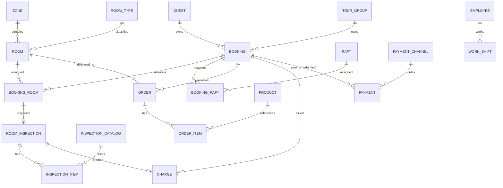

# ฐานข้อมูล

ฐานข้อมูลเป็น PostgreSQL จัดการด้วย Prisma schema และ migrations 7 ชุด ณ เวลาจัดทำเอกสาร.

## ER Diagram

## Models

| Model | หน้าที่/Field สำคัญ | Relation/Constraint/Index | ข้อควรปรับปรุง |
|---|---|---|---|
| Zone | โซนอาคาร | `name` unique, มี Rooms | ไม่มี soft delete |
| RoomType | ประเภทห้อง ราคา ความจุ เตียง | `name` unique | ราคาไม่มี effective date |
| Room | inventory ห้องและ operational status | number unique; index zone/status | status กับช่วงเวลาจองอาจคลาดกันได้ |
| Raft | inventory แพ ราคา/ความจุ | number unique; status index | lifecycle status มีเพียง available/maintenance |
| Guest | ลูกค้ารายบุคคล | phone index | ไม่มี unique identity/dedup rule |
| TourGroup | กลุ่มและผู้ติดต่อ | Booking relation | ไม่มี unique/dedup rule |
| Booking | aggregate หลัก วัน สถานะ ลูกค้า ราคาเหมา `closedAt` | reference unique; date/status index | DB ไม่บังคับ guest XOR tourGroup หรือ checkOut > checkIn |
| BookingRoom | ห้องใน booking และราคา snapshot | unique booking+room; cascade booking | ไม่มี DB exclusion constraint ป้องกันวันซ้ำ |
| BookingRaft | แพใน booking และราคา snapshot | unique booking+raft | เช่นเดียวกับ BookingRoom |
| RoomInspection | งานตรวจหนึ่งรายการต่อ BookingRoom | bookingRoomId unique; status index | ไม่มีผู้ตรวจ/เวลาเริ่ม/audit |
| InspectionItem | snapshot รายการตรวจ จำนวน ราคา | FK catalog optional | client payload ยังมี field ราคาแม้ server override |
| InspectionCatalog | ราคากลางงานตรวจ | name unique; type/active index | ไม่มี UI/API จัดการเต็มรูปแบบหรือ version ราคา |
| Product | อาหาร/มินิบาร์/อื่น ๆ | type/active index | ไม่มี SKU/stock/tax |
| Order | ออเดอร์ผูก booking/room แบบ optional | number unique; status/time index | ไม่มีผู้สร้าง/จุดส่งแบบ structured |
| OrderItem | snapshot สินค้า จำนวน ราคา หมายเหตุ | cascade ตาม Order | ไม่มี constraint quantity > 0 |
| Charge | ค่าใช้จ่ายระดับ booking | booking/type index; inspectionId unique | type ของ inspection ใช้ OTHER ไม่ละเอียด |
| Payment | รับเงินและคืนเงิน ใช้ status แยก | booking/status index; channel optional | ใช้ `paidAt` กับ refund และไม่มี originalPaymentId |
| PaymentChannel | ช่องทางรับ/คืนเงิน | name unique; active index | ไม่มีข้อมูลบัญชีหรือ audit |
| Employee | master พนักงาน | authUserId unique | ยังไม่เชื่อม workflow/auth จริง |
| WorkShift | เวลาเข้าออกงาน | employee/start index | ไม่มี validation endsAt > startsAt |

## Business Rules ที่บังคับใน Application

- booking ต้องมีห้องหรือแพอย่างน้อยหนึ่งรายการ
- overlap ใช้เงื่อนไข `existing.checkIn < newCheckOut && existing.checkOut > newCheckIn`
- รายการ `CANCELLED` และ `CHECKED_OUT` ไม่บล็อกช่วงวัน
- กลุ่มคิดราคา `guestCount × pricePerPerson`
- InspectionItem ใช้ราคาจาก InspectionCatalog ฝั่ง server
- ปิดงานได้เมื่อเช็กเอาต์และทุกห้องตรวจ `COMPLETED`
- Refund ได้เฉพาะ booking ที่ยกเลิกและไม่เกินยอดรับสุทธิ

## Migration History

เริ่มจาก core hotel schema แล้วเพิ่ม Raft, group pricing, housekeeping inspection, inspection-charge link, central catalogs/payment channels และ `bookings.closed_at` ตามลำดับ.
