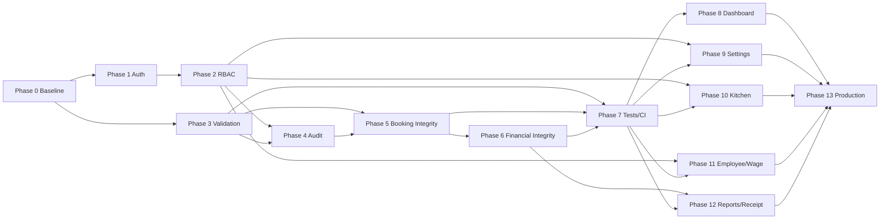

# Implementation Plan

เอกสารนี้เป็นแผนพัฒนาหลักของ Resident Hotel Management ใช้ร่วมกับ [ROADMAP.md](./ROADMAP.md) สำหรับทิศทางระดับเวลา และ [TODO.md](./TODO.md) สำหรับรายการงานตามความเร่งด่วน

## เป้าหมายสุดท้าย

ทำให้ระบบพร้อมใช้งานจริงโดยมี Security boundary, Data Integrity, Auditability, Automated Verification, Operational Modules และ Production Runbook ที่ตรวจสอบได้ โดยรักษา Business Rules ที่ยืนยันจาก Source Code ปัจจุบัน

## สถานะปัจจุบัน

- เวอร์ชันปัจจุบันใน `package.json`: `0.1.0`
- Core prototype ที่มีหลักฐาน: Booking, Room/Raft availability, Package/Extra pricing, Food order creation, Partial payment, Refund, Housekeeping inspection และ Close job
- Placeholder/ช่องว่าง: Dashboard, Kitchen workflow, Employee/Shift/Wage, Reports/Receipt/Export และ Settings CRUD
- Critical blockers: credential exposure ใน `.env.example`, ไม่มี Authentication/Authorization/RLS/Audit Log และไม่มี automated tests/CI
- Working tree มีการแก้ไขจำนวนมากจากการพัฒนาก่อนหน้า จึงต้องรักษา user changes และห้ามทำ broad refactor/reset

## Dependency หลัก

## สถานะ Phase

| Phase | สถานะ | Foundation ที่พบจริง | Dependency |
|---|---|---|---|
| 0 — Baseline/Repository Security | COMPLETED | credential containment, lint/build/type baseline, Phase 0 report | ไม่มี |
| 1 — Authentication/User Management | VERIFIED | Login/Logout, session middleware, Employee mapping, guards และ expiry/refresh/revocation E2E ผ่าน | Phase 0, Approval |
| 2 — Authorization/RBAC | NOT_STARTED | `Employee.role` เป็น String; ยังไม่มี enforcement | Phase 1 |
| 3 — Validation/Error Contract | NOT_STARTED | manual validation และ `{message}` กระจาย | Phase 0 |
| 4 — Audit Log | NOT_STARTED | timestamps บาง model; ไม่มี actor/action log | Phase 1–3 |
| 5 — Booking/Availability Integrity | NOT_STARTED | prototype overlap, transaction และ lifecycle มีแล้ว | Phase 3–4 |
| 6 — Pricing/Payment/Refund Integrity | NOT_STARTED | snapshot pricing, partial payment/refund มีแล้ว | Phase 3–5 |
| 7 — Automated Tests/CI | NOT_STARTED | lint/build มี; ไม่มี test/typecheck script/CI | Phase 3–6 |
| 8 — Dashboard/Daily Work | NOT_STARTED | Route placeholder | Phase 5–7 |
| 9 — Settings/Master Data | NOT_STARTED | models/read APIs/seed บางส่วน | Phase 2–3, 7 |
| 10 — Kitchen Workflow | NOT_STARTED | Order schema/create API; Kitchen placeholder | Phase 2–3, 7 |
| 11 — Employee/Shift/Wage | NOT_STARTED | Employee/WorkShift schema; UI placeholder | Phase 1–3, 7 |
| 12 — Reports/Receipt/Export | NOT_STARTED | Report placeholder | Phase 6–7 |
| 13 — Production Readiness | NOT_STARTED | TLS CA และ production build script | Phase 0–12 |

## Phase 0 — Baseline และความปลอดภัยของ Repository

### เป้าหมาย

สร้าง baseline ที่ทำซ้ำได้ ปิดความเสี่ยง secret ระดับ repository และบันทึกข้อผิดพลาดเดิม โดยไม่เปลี่ยน Feature

### Tasks

| Task | สถานะ | ผล/เงื่อนไข |
|---|---|---|
| 0.1 Secret Leakage Audit | COMPLETED | สแกนแบบไม่แสดงค่าความลับ; พบ `.env.example` เสี่ยงจริง |
| 0.2 Credential Containment | COMPLETED | rotate credential, sanitize example, สแกน history และยืนยัน Prisma connection |
| 0.3 Baseline Lint/Typecheck/Build | COMPLETED | lint, TypeScript strict noEmit และ production build ผ่าน |
| 0.4 Baseline Report | COMPLETED | สรุป evidence, residual risks, verification gaps และ Phase 1 gate |

### Acceptance Criteria

- Secret ที่ใช้จริงไม่อยู่ใน tracked/example/document files
- Credential ที่เปิดเผยได้รับการ rotate โดยเจ้าของระบบ
- ตรวจ Git history ด้วยหลักฐาน; purge เฉพาะเมื่อพบและได้รับอนุมัติ
- `npm run lint` และ `npm run build` มีผล baseline ที่บันทึกได้
- TypeScript validation มีผลจริงจาก build หรือคำสั่งที่มี; ช่องว่าง test/typecheck script ถูกบันทึก
- ไม่มี Feature behavior เปลี่ยนโดยไม่จำเป็น

### Verification

- Secret scan ที่ไม่พิมพ์ค่าความลับ
- `git check-ignore`, `git ls-files`, path history inspection
- `npm run lint`, `npm run build`
- ตรวจ `package.json` scripts และ `git diff --check`

### ความเสี่ยงและ Rollback

- การ rotate/purge history เป็น external/destructive action ต้องขออนุมัติและมี incident plan
- การ sanitize `.env.example` ย้อนกลับได้ด้วย Git แต่ห้ามนำค่าจริงกลับมา
- หาก baseline command เขียน artifact ให้จำกัดเฉพาะ generated/ignored output และห้ามแก้ Source Code

## Phase 1 — Authentication และ User Management

### Current Task Status

- Task 1.14 Access Token Wall-clock Expiry Verification: COMPLETED — wall-clock suite 2/2 และ rollback TTL verification ผ่าน
- Task 1.14 final gate ผ่านแล้ว; Phase 1 VERIFIED
- งาน Auth อื่นที่ไม่ขึ้นกับ wall-clock expiry สามารถดำเนินการตาม dependency/priority ได้
- Task 1.15 Auth Guard Coverage Audit/Tests: COMPLETED — protected API handlers 17/17 และ full Auth suite 24/24 ผ่าน
- Task 1.16 Application Page Guard Coverage: COMPLETED — protected pages 12/12 และ full Auth suite 36/36 ผ่าน
- Task 1.17 Phase 1 Non-expiry Readiness Audit: COMPLETED — พบ Employee mapping enforcement gap
- Task 1.18 Employee Mapping Enforcement: COMPLETED — centralized Node.js middleware boundary และ unmapped-user denial E2E ผ่าน

### เป้าหมาย

Supabase Auth, Login/Logout, server-validated Session, Protected Routes และการเชื่อม Employee ตาม design ที่ได้รับอนุมัติ

### Acceptance Criteria/Verification

- ผู้ไม่ authenticate เข้าหน้าหรือ API ที่ป้องกันไม่ได้
- Session expiry/logout/revocation ทำงาน; ไม่มี secret ใน client
- Identity mapping กับ Employee มี constraint และ migration ที่ปลอดภัย
- Integration/E2E tests ครอบคลุม login/logout/protected route

### ความเสี่ยง/Rollback

เป็น Authentication architecture change ต้อง `NEEDS_APPROVAL`; ใช้ feature flag/rollback session middleware และ migration แบบ additive

## Phase 2 — Authorization และ RBAC

### Task 2.3 — API Permission Enforcement (`IN_PROGRESS / NOT VERIFIED`)

- **2.3a Test fixture strategy และ role-storage decision — COMPLETED:** E2E fixtures ใช้ role codes `RECEPTION`, `HOUSEKEEPING`, `KITCHEN`, `ACCOUNTING`, `MANAGER`; alias `ผู้ดูแลระบบ` คงไว้ชั่วคราวถึง Task 2.5
- **2.3b Provision dedicated Auth/Employee fixtures — WAITING_FOR_USER:** สร้าง Auth users แยกและ Employee fixtures ตามชื่อที่กำหนดใน `RBAC_TEST_USERS_SETUP.md`
- **2.3c Cross-role HTTP E2E — BLOCKED_BY_2.3b:** ต้องพิสูจน์ allowed/forbidden/unknown-role behavior ก่อนถือว่า API RBAC verified
- **2.3d Fixture cleanup/retention decision — PENDING:** ตัดสินใจเก็บหรือลบ fixtures หลัง verification; การลบเป็น destructive action ต้องขออนุมัติ

Hard stop: ห้ามขยาย API permission enforcement เพิ่มจนกว่า Task 2.3c จะผ่าน

Task 2.5 จะตัดสินใจ schema hardening/standardization และการยกเลิก legacy alias; ห้ามลบ alias `ผู้ดูแลระบบ` ก่อนถึง Task นี้

### เป้าหมาย

กำหนด Admin, Manager, Front Desk, Cashier, Housekeeping และ Kitchen ทั้ง UI และ Server/API

### Acceptance Criteria/Verification

- ทุก mutation มี server-side permission check; การซ่อนเมนูไม่ใช่ security boundary
- มี permission matrix และ 401/403 contract; ทดสอบ allow/deny ทุก role สำคัญ

### ความเสี่ยง/Rollback

สิทธิ์ผิดอาจเปิดข้อมูลหรือหยุดงาน; rollout แบบ default deny พร้อม admin recovery path

## Phase 3 — Validation และ Error Contract

### เป้าหมาย

Runtime validation, standard response/error และปฏิเสธข้อมูล client ที่ไม่น่าเชื่อถือ

### Acceptance Criteria/Verification

- ทุก public mutation validate body/query/path; ไม่มีการพึ่ง TypeScript cast เป็น validation
- Error มี code/message/status สม่ำเสมอและไม่เปิด stack/secret
- Contract tests ครอบคลุม invalid/boundary payload

### ความเสี่ยง/Rollback

อาจเปลี่ยน API contract; ทำ endpoint-by-endpoint และรักษา compatibility จน client ย้ายครบ

## Phase 4 — Audit Log

### เป้าหมาย

บันทึก actor, time, action, entity, entityId, reason และ before/after ตามความเหมาะสม

### Acceptance Criteria/Verification

- Payment, Refund, Booking lifecycle, Inspection และ Master Data มี immutable audit record
- Audit query จำกัดสิทธิ์และไม่บันทึก secret/PII เกินจำเป็น

### ความเสี่ยง/Rollback

ข้อมูลโตและ privacy risk; migration additive, retention policy และ write failure strategy ต้องชัดเจน

## Phase 5 — Booking และ Availability Integrity

### เป้าหมาย

ยืนยัน overlap, transaction/concurrency, Asia/Bangkok date boundary และ lifecycle เป็น source เดียว

### Acceptance Criteria/Verification

- Concurrent booking ห้อง/แพเดียวกันไม่สำเร็จซ้ำ
- Rule วันและ transition มี unit/integration concurrency tests
- Operational room status กับ availability มี invariant/documented reconciliation

### ความเสี่ยง/Rollback

Constraint/migration อาจกระทบข้อมูลเดิม; audit conflict ก่อน migrate และใช้ additive/validated rollout

## Phase 6 — Pricing, Charge, Payment และ Refund

### เป้าหมาย

รวม calculation, immutable ledger, refund อ้าง payment ต้นทาง, idempotency, transaction และ audit

### Acceptance Criteria/Verification

- Grand/paid/outstanding/refundable ใช้ source เดียวและ Decimal-safe
- Duplicate request ไม่สร้างเงินซ้ำ; refund ไม่เกินยอดและ trace กลับ payment ได้
- Financial integration/concurrency tests ผ่าน

### ความเสี่ยง/Rollback

เป็น high-risk data migration; ต้อง reconciliation, backup, dual-read/write plan และ approval

## Phase 7 — Automated Tests และ CI

### เป้าหมาย

Unit, Integration, E2E, lint, typecheck, test และ build เป็น CI gates

### Acceptance Criteria/Verification

- Critical journeys ใน `TESTING_GUIDE.md` ทำซ้ำได้บน isolated environment
- PR ไม่ผ่านเมื่อ lint/type/test/build ล้มเหลว
- ไม่มี test ใช้ production database

### ความเสี่ยง/Rollback

เพิ่ม dependency/CI ต้อง approval; เริ่มจาก minimal stack และไม่ลด assertion เพื่อแก้ flaky test

## Phase 8 — Dashboard และงานประจำวัน

### เป้าหมาย

แสดงห้องว่าง Check-in/out ห้องรอตรวจ ยอดรับ ยอดค้าง และงานค้างจากข้อมูลจริง

### Acceptance Criteria/Verification

- ตัวเลข reconcile กับ source transaction; permission และ timezone ถูกต้อง
- Query มีขอบเขต/cache policy และ performance baseline

### ความเสี่ยง/Rollback

Aggregate ผิดทำให้ตัดสินใจผิด; เปิดแบบ read-only และเทียบรายงานต้นทาง

## Phase 9 — Settings และ Master Data

### เป้าหมาย

CRUD Zone, Room Type, Room, Raft, Product, Package, Inspection Catalog และ Payment Channel สำหรับ Admin/Manager

### Acceptance Criteria/Verification

- Validation, RBAC, audit และ referential integrity ครบ
- ห้ามลบ master ที่ถูกอ้างโดยไม่มีกฎ archive/deactivate

### ความเสี่ยง/Rollback

การแก้ราคา/master กระทบอนาคต; snapshot เดิมต้องไม่เปลี่ยนและใช้ soft disable

## Phase 10 — Kitchen Workflow

### เป้าหมาย

รองรับ PENDING, PREPARING, READY, DELIVERED, CANCELLED พร้อมเวลาและผู้รับผิดชอบ

### Acceptance Criteria/Verification

- State transition server-side ถูกต้องและมี role/audit
- UI แสดง queue จริงและไม่สูญออเดอร์เมื่อ refresh

### ความเสี่ยง/Rollback

Realtime/notification เป็น architecture choice; เริ่ม polling/read model ก่อนหากยังไม่อนุมัติ infrastructure

## Phase 11 — Employee, Shift และ Wage

### เป้าหมาย

Employee, Schedule, Shift, Attendance, Wage และ Permission linkage

### Acceptance Criteria/Verification

- เวลาเข้าออกและ wage calculation มี timezone/rounding rule ที่อนุมัติ
- HR/financial data จำกัดสิทธิ์และ audit ได้

### ความเสี่ยง/Rollback

ยังไม่มี Business Rule attendance/wage ครบ; ห้ามเดาจนเจ้าของระบบยืนยัน

## Phase 12 — Reports, Receipt และ Export

### เป้าหมาย

รายงานการจอง/รายรับ/ยอดค้าง ใบรับเงิน ใบคืนเงิน ใบเสร็จ และ PDF/Print/Export

### Acceptance Criteria/Verification

- Reconcile กับ ledger; numbering/tax rule ได้รับการยืนยัน
- Export ป้องกัน unauthorized data และ formula injection

### ความเสี่ยง/Rollback

ข้อกำหนดบัญชี/ภาษียังไม่ครบ; ห้ามเรียกเอกสารว่าใบกำกับภาษีโดยไม่มี requirement

## Phase 13 — Production Readiness

### เป้าหมาย

Logging, monitoring, backup/restore test, deployment/rollback, performance, accessibility, responsive และ production checklist

### Acceptance Criteria/Verification

- Critical checklist ทุกข้อมีหลักฐาน; restore drill และ rollback drill ผ่าน
- Security test, load baseline, accessibility review และ smoke tests ผ่าน
- ไม่มี Critical blocker เปิดอยู่

### ความเสี่ยง/Rollback

Production/external action ต้อง approval; deploy แบบ staged พร้อม monitoring threshold และ rollback owner

## กฎการเปลี่ยนสถานะ

- `COMPLETED`: implementation และเอกสารครบ แต่ยังไม่ผ่าน verification ทั้งหมด
- `VERIFIED`: Acceptance Criteria และ Verification มีหลักฐานจริง
- ห้ามข้าม Phase ที่เป็น dependency เว้นแต่บันทึก blocker/risk/approval ชัดเจน
- อัปเดตสถานะล่าสุดใน `PROJECT_STATUS.md` และ append ประวัติใน `WORK_LOG.md` ทุก Session
