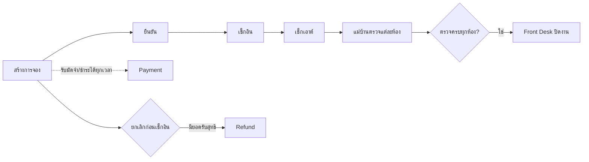

# ภาพรวมโครงการ Resident Hotel Management

## วัตถุประสงค์

ระบบเว็บสำหรับงานปฏิบัติการที่พัก ครอบคลุมการจองห้องและแพ ลูกค้ารายเดี่ยว/กลุ่ม อาหาร ค่าใช้จ่าย การรับและคืนเงิน การตรวจห้องหลังเช็กเอาต์ และประวัติการจอง แหล่งอ้างอิงหลักคือ `app/`, `components/`, `prisma/schema.prisma` และ Route Handlers ใน `app/api/`.

## ผู้ใช้งานที่ระบบสื่อถึง

- Front Desk: สร้าง/ยืนยัน/เช็กอิน/เช็กเอาต์/ยกเลิก เพิ่มทรัพยากร รับเงิน คืนเงิน และปิดงาน
- แม่บ้าน: ตรวจห้อง เลือกรายการเสียหายหรือมินิบาร์จากราคากลาง และคืนสถานะห้องเป็นว่าง
- ผู้รับออเดอร์: เลือกลูกค้าที่พักและสร้างออเดอร์อาหาร/มินิบาร์
- ครัว ผู้ดูแลพนักงาน บัญชี และผู้บริหาร: มี Route/เมนู แต่บางหน้าเป็น placeholder
- Authentication และการผูกผู้ใช้กับบทบาท: ยังไม่พบการ Implement

## Feature ที่ Implement แล้ว

- การจองรายเดี่ยวและกลุ่ม เลือกห้อง/แพอย่างน้อยหนึ่งรายการ ตรวจช่วงวันซ้ำ และห้ามวันย้อนหลัง
- ราคากลุ่มแบบจำนวนคนคูณราคาต่อหัว; ห้อง แพ และอาหารแรกเริ่มรวมในราคาเหมา ส่วนที่เพิ่มภายหลังคิดเพิ่ม
- Booking lifecycle: `PENDING → CONFIRMED → CHECKED_IN → CHECKED_OUT`; ยกเลิกได้ก่อนเช็กอิน
- ตรวจห้องหลังเช็กเอาต์ ราคากลาง ค่าเสียหาย และปิดงาน
- รับเงินหลายงวด งวดแรกเป็นมัดจำ และคืนเงินหลังยกเลิก
- สั่งอาหาร/มินิบาร์และรวมรายการที่เป็น extra ในยอดค้าง
- ประวัติรายการเช็กเอาต์/ปิดงาน/ยกเลิก

## Tech Stack

- Next.js 15 App Router, React 19, TypeScript strict
- Tailwind CSS 4, PostCSS, Lucide React
- Prisma ORM 7 + `@prisma/adapter-pg` + PostgreSQL/Supabase
- Redux Toolkit สำหรับตะกร้าและ snapshot รายละเอียดการจองบางส่วน
- TLS เชื่อมฐานข้อมูลด้วย CA certificate ใน `certs/prod-ca-2021.crt`

## Workflow หลัก

## ขอบเขตที่ยังไม่สมบูรณ์

Dashboard, Kitchen, Employee Schedule, Wage และ Report มีหน้า Route แต่ยังเป็นข้อความ placeholder. Settings ไม่มี Route จริง. ไม่พบระบบทดสอบอัตโนมัติ, Authentication, Authorization, audit log, rate limiting หรือ Supabase RLS configuration ใน repository.
