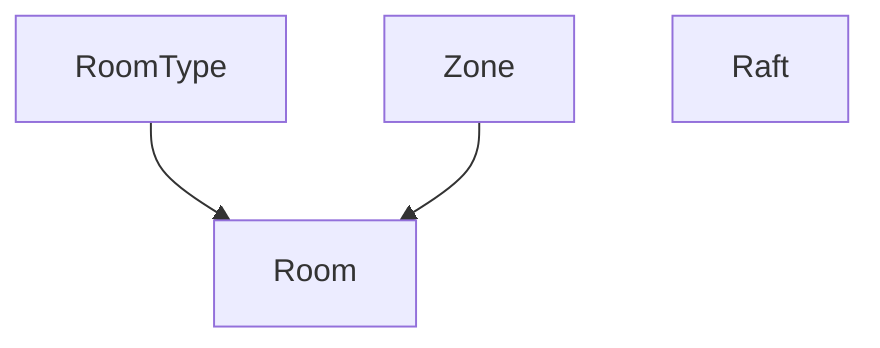

# Phase 15 — Master Data CRUD Implementation Plan

## Objective

พัฒนาหน้า `/settings` ให้สามารถจัดการ Master Data ได้จริง
โดยรักษา UI และ architecture เดิมให้มากที่สุด

## Working Rules

1. เริ่มจากอ่าน:
   - `AGENTS.md`
   - `docs/CURRENT_TASK.md`
   - ส่วน Phase 15 ใน `docs/MASTER_PLAN.md`
   - ไฟล์นี้

2. อ่านเฉพาะไฟล์ที่เกี่ยวข้องกับ Master Data module ที่กำลังทำ

3. ห้าม scan repository ทั้งหมด เว้นแต่ค้นหาแบบเจาะจงแล้วยังไม่พบ dependency

4. ภายในหนึ่ง Task ให้ทำต่อเนื่องตามลำดับ:
   - Inspect
   - Implement
   - Validate
   - Test
   - Fix
   - Update documentation

5. ไม่ต้องหยุดขอ approval ระหว่างขั้นตอนของ Task เดียวกัน

6. หยุดและขอ approval เฉพาะกรณี:
   - destructive database migration
   - architecture change
   - requirement ambiguity ที่มีผลต่อพฤติกรรมธุรกิจ
   - พบว่าต้องแก้ระบบนอก Scope อย่างมีนัยสำคัญ

7. ห้ามทำ speculative refactor

8. ห้ามสร้าง abstraction กลางจนกว่าจะพบการใช้งานซ้ำอย่างน้อย 2 โมดูล

---

## Standard CRUD Pattern

Master Data แต่ละโมดูลควรใช้ flow ดังนี้:

### List

- ดึงข้อมูลจาก API/database จริง
- แสดง loading state
- แสดง empty state
- แสดง error state
- รองรับ active/inactive state

### Create

- ปุ่มเพิ่มข้อมูลอยู่ในส่วนหัวของ module
- เปิด modal หรือ drawer
- validate ข้อมูลก่อน submit
- disable ปุ่มระหว่างบันทึก
- แจ้งผลสำเร็จหรือข้อผิดพลาด
- refresh หรือ update list หลังบันทึก

### Edit

- มีปุ่มแก้ไขในแต่ละรายการ
- form แสดงข้อมูลเดิม
- submit เฉพาะข้อมูลที่อนุญาต
- ป้องกัน duplicate และ invalid relation
- update list หลังบันทึก

### Activate / Deactivate

- ใช้ soft-disable หากข้อมูลอาจถูกอ้างอิงในประวัติ
- ไม่ลบข้อมูลจริงโดยไม่มี requirement ชัดเจน
- แสดง confirmation เมื่อมีผลต่อส่วนอื่น
- รายการ inactive ต้องไม่ปรากฏในตัวเลือกใช้งานใหม่

### Permissions

- UI ซ่อนหรือ disable action ตามสิทธิ์
- API ตรวจ permission ซ้ำ
- unauthorized request ต้องคืน error ที่เหมาะสม

---

## UI Direction

รักษารูปแบบหน้า Master Data ปัจจุบัน:

- ใช้ card เดิม
- เพิ่มปุ่ม “เพิ่ม” ที่ส่วนหัวของแต่ละ card
- เพิ่ม action “แก้ไข” ในแต่ละรายการ
- ใช้ modal หรือ drawer แบบเดียวกันทุกโมดูล
- ไม่ redesign sidebar หรือโครงสร้างหน้า
- ไม่เปลี่ยนสีหรือ typography โดยไม่จำเป็น

กรณีรายการมีจำนวนมาก สามารถเพิ่ม:

- Search
- Filter active/inactive
- Pagination

แต่เพิ่มเฉพาะเมื่อข้อมูลหรือ component เดิมรองรับจริง

---

## Verification Checklist Per Module

สถานะรวม (Task 15.10 — 2026-07-12): **PASSED** ผ่าน `npm run test:ci` + regression E2E (auth/RBAC/booking/payment/health) หลัง apply migrations `is_active`

- [x] โหลดรายการจากข้อมูลจริง (settings managers + master APIs)
- [x] เพิ่ม/แก้ไข/activate-deactivate + validation (unit + API handlers 15.2–15.8)
- [x] inactive ไม่เข้า consumer: rooms (zone/type active), rafts AVAILABLE, products/inspection/payment active-only
- [x] API permission ทำงาน (`masterDataPermissionMatrix` + cross-role E2E)
- [x] typecheck / lint / unit / build ผ่าน
- [x] relevant regression tests ผ่าน (83 E2E ในชุด 15.10)
- [x] อัปเดต CURRENT_TASK.md / MASTER_PLAN.md

---

## Out of Scope

- redesign หน้า Settings ใหม่ทั้งหมด
- เปลี่ยน framework
- เปลี่ยนระบบ authentication
- refactor ระบบจองทั้งระบบ
- เพิ่ม feature ที่ไม่เกี่ยวกับ Master Data
- ลบ historical records
- migration ขนาดใหญ่โดยไม่มี approval

---

## Audit Results (Task 15.1 — 2026-07-12)

อ้างอิงจากโค้ดจริงเท่านั้น ไม่มี CRUD implementation ใน Task นี้

### สรุปหน้า Settings ปัจจุบัน

| รายการ | หลักฐาน |
|--------|---------|
| Route / page | `app/settings/page.tsx` — Server Component, `export const dynamic = "force-dynamic"` |
| Data access | `prisma.*.findMany` โดยตรงใน page (ไม่มี service layer แยก) |
| UI structure | `SectionCard`, `SummaryPill` ในไฟล์เดียวกัน — ไม่มี sub-component ต่อโมดูล |
| Helper | `lib/settings/master-data-summary.ts` — `countActiveRecords` สำหรับ `isActive` หรือ `status` |
| Page permission | `lib/auth/authorization.ts` — `/settings` → `settings.manage` (ADMIN, MANAGER) |
| Sidebar | `components/layout/Sidebar.tsx` — ลิงก์ `/settings` |

โมดูล **Employees & Roles** แสดงบนหน้าเดียวกันแต่ **อยู่นอก Scope Task 15.1** (ไม่รวมในตารางด้านล่าง)

---

### 1. Room Types

| หัวข้อ | สถานะ | หลักฐาน |
|--------|--------|---------|
| UI | Read-only ใน card "Room Types & Zones" | `app/settings/page.tsx` — `prisma.roomType.findMany` |
| API | ไม่มี | ไม่มี `app/api/room-types` หรือเทียบเท่า |
| Service / repository | ไม่มี — อ่านผ่าน Prisma ใน page และฝังใน booking/rooms | `GET /api/rooms` ส่ง `roomType` nested |
| DB table | `room_types` (`RoomType`) | `prisma/schema.prisma` |
| Read | ใช่ (settings + nested ใน `GET /api/rooms`) | |
| Create | ไม่มี | seed เท่านั้นใน `prisma/seed.ts` |
| Update | ไม่มี | |
| Activate / deactivate | ไม่มี — **ไม่มีฟิลด์ `isActive`** ใน schema | แสดงทุก record บน settings |
| Validation | DB: `name` `@unique`; ไม่มี API validation | |
| Permission | หน้า: `settings.manage`; ไม่มี API เฉพาะโมดูล | |
| Downstream | ราคาจองใช้ `room.roomType.basePrice` | `app/api/bookings/route.ts`, `resources/route.ts` |

**Missing work:** REST (หรือ route handler) list/create/update; กลยุทธ์ปิดใช้งาน (ต้องตัดสิน: เพิ่ม `isActive` หรือกฎอื่น — schema ปัจจุบันไม่รองรับ soft-disable); ฟอร์ม modal บน settings; map permission (`settings.manage` และ/หรือ `resource.manage` — Task 15.9); tests

---

### 2. Zones / Buildings

| หัวข้อ | สถานะ | หลักฐาน |
|--------|--------|---------|
| UI | Read-only ใน card เดียวกับ room types | `zone.name` + `zone.rooms.length` |
| API | ไม่มี | Zone ปรากฏเฉพาะ nested ใน `GET /api/rooms` → `zone.id`, `zone.name` |
| Service | ไม่มี | |
| DB table | `zones` (`Zone`) — `name` `@unique`, relation `rooms` | `prisma/schema.prisma` |
| Read | ใช่ (settings + rooms API) | `components/ui/ZoneRoomSelect.tsx` ใช้ zones จาก room list |
| Create / Update | ไม่มี | |
| Activate / deactivate | ไม่มี — **ไม่มี `isActive`** | |
| Validation | DB: `name` unique | |
| Permission | `settings.manage` (page only) | |
| Dependency | Room ต้องมี `zoneId` FK | ปิดโซนที่มีห้องต้องมีกฎธุรกิจ (Task 15.3) |

**Missing work:** API CRUD; นับห้องต่อโซน (มีข้อมูลแล้วใน settings ผ่าน `include: { rooms }`); confirmation เมื่อปิดโซนที่มีห้อง; อาจต้อง schema สำหรับ soft-disable

---

### 3. Rooms

| หัวข้อ | สถานะ | หลักฐาน |
|--------|--------|---------|
| UI | Read-only บน settings (สูงสุด 8 รายการ); จองใช้ `ZoneRoomSelect` | `app/settings/page.tsx`, `components/ui/ZoneRoomSelect.tsx` |
| API | `GET /api/rooms` เท่านั้น | `app/api/rooms/route.ts` |
| Service | `lib/bookings/availability.ts` — `availableRoomStatuses`, conflict dates | |
| DB table | `rooms` — `status` `RoomStatus`, FK `zoneId`, `roomTypeId`, `number` `@unique` | |
| Read | ใช่ | Query `checkIn`/`checkOut` สำหรับ `booked` |
| Create / Update | ไม่มี master-data API | |
| Activate / deactivate | ไม่มี API ตั้งค่า — ใช้ **`status`** (AVAILABLE, OCCUPIED, CLEANING, MAINTENANCE) | `countActiveRecords(rooms, availableRoomStatuses)` บน settings |
| Validation | ช่วงวันที่ใน GET; unique `number` ที่ DB | |
| Permission | `GET` → `resource.read`; **ไม่มี** rule สำหรับ room CRUD | `resource.manage` ใช้กับ `POST /api/bookings/.../resources` เท่านั้น |
| Downstream | จอง, orders (`roomId`), inspections | |

**Missing work:** `POST`/`PATCH` (หรือ `PUT`) สำหรับ master data; แยก “ปิดจากการจองใหม่” กับสถานะปฏิบัติการ (เช่น MAINTENANCE); รายการเต็มบน settings + CRUD UI; permission rules ใหม่; ไม่ filter status ใน `GET /api/rooms` (ทุก status ถูกส่ง — การเลือกใช้งานใหม่พึ่ง `booked` + status)

---

### 4. Rafts

| หัวข้อ | สถานะ | หลักฐาน |
|--------|--------|---------|
| UI | Settings (slice 8); จอง `RaftSelect` | `components/ui/RaftSelect.tsx` |
| API | `GET /api/rafts` เท่านั้น | `app/api/rafts/route.ts` |
| DB table | `rafts` — `number` `@unique`, `status` `RaftStatus` (AVAILABLE, MAINTENANCE) | |
| Read | ใช่ | |
| Create / Update | ไม่มี | |
| Activate / deactivate | ผ่าน **`status`** โดยไม่มี API | `availableRaftStatuses` |
| Permission | `GET` → `resource.read` | |
| Downstream | `bookingRafts`, ราคา `basePrice` | |

**Missing work:** CRUD API + UI; PATCH status; validation ซ้ำ `number`; permission สำหรับ mutate

---

### 5. Products

| หัวข้อ | สถานะ | หลักฐาน |
|--------|--------|---------|
| UI | Settings (slice 8); อาหาร `app/foodOrder/.../food/page.tsx` | |
| API | `GET /api/products` — filter **`isActive: true`**, optional `type` | `app/api/products/route.ts` |
| DB table | `products` — `isActive`, `type` `ProductType`, **ไม่มี unique บน `name`** | |
| Read | ใช่ (settings โหลดทั้งหมด; consumer เฉพาะ active) | |
| Create / Update | ไม่มี | |
| Activate / deactivate | ฟิลด์ `isActive` มีแล้ว แต่ **ไม่มี API เปลี่ยน** | |
| Validation | enum `type` ใน GET query | |
| Permission | `GET` → `catalog.read`; **`catalog.manage` ยังไม่ผูก API route** | `MANAGER` มี `catalog.manage` ใน `authorization.ts` |
| Downstream | `OrderItem` | |

**Missing work:** POST/PATCH; list สำหรับ settings (รวม inactive); duplicate handling ตาม business; ผูก `catalog.manage` กับ mutation routes

---

### 6. Inspection Catalog

| หัวข้อ | สถานะ | หลักฐาน |
|--------|--------|---------|
| UI | Settings; `houseKeeperMinibar` fetch catalog | `app/houseKeeperMinibar/page.tsx` |
| API | `GET /api/inspection-catalog` — **`isActive: true` only** | `app/api/inspection-catalog/route.ts` |
| DB table | `inspection_catalogs` — `name` `@unique`, `type` `InspectionItemType`, `isActive` | |
| Read | ใช่ | |
| Create / Update / deactivate | ไม่มี API | |
| Validation | — | |
| Permission | `GET` → `catalog.read` | |
| Downstream | `InspectionItem.catalogId` optional FK | |

**Missing work:** CRUD API; admin list รวม inactive; `catalog.manage` enforcement; UI modal

---

### 7. Payment Channels

| หัวข้อ | สถานะ | หลักฐาน |
|--------|--------|---------|
| UI | Settings แสดงทุก channel; `PayButton` โหลด/เพิ่ม | `components/ui/PayButton.tsx` |
| API | `GET` (active only) + **`POST` upsert** | `app/api/payment-channels/route.ts` |
| Service pattern | `readJsonObject`, `validationErrorResponse` | `lib/api/validation.ts` |
| Audit | `recordAuditLog` on POST | `lib/audit/audit-log.ts` |
| DB table | `payment_channels` — `name` `@unique`, `method` `PaymentMethod`, `isActive` | |
| Read | ใช่ — settings ทุก record; GET API เฉพาะ active | |
| Create | **บางส่วน** — POST สร้างหรือ reactivate (`upsert` ตั้ง `isActive: true`) | |
| Update | บางส่วน — upsert อัปเดต `method` ถ้าชื่อซ้ำ | ไม่มี PATCH ตาม id |
| Deactivate | **ไม่มี** — ไม่มี endpoint ตั้ง `isActive: false` | |
| Validation | name + PaymentMethod enum | |
| Permission | `GET` → `payment.read`; `POST` → `payment_channel.manage` | ADMIN, MANAGER, ACCOUNTING |

**Missing work:** PATCH/deactivate; list ทั้งหมดสำหรับ settings ผ่าน API (หรือ server action แยก); แยก create กับ edit ชัดใน UI; warning เมื่อปิด channel ที่มี payment อ้างอิง (ต้องตรวจ relation `payments`)

---

## CRUD Pattern ที่ใช้ซ้ำได้ (ยืนยันจากโค้ด)

| ชั้น | Pattern ที่มีอยู่ | ใช้กับโมดูลใหม่ |
|------|-------------------|----------------|
| List (consumer) | `GET` + auth middleware + `resolveApiPermission` | ทุกโมดูลที่ client เรียก |
| List (settings admin) | ปัจจุบัน: **Server Component + Prisma** | คงได้ระหว่าง transition หรือเพิ่ม `GET` รวม inactive ตามโมดูล |
| Mutate body | `readJsonObject` → `ValidationIssue[]` → `validationErrorResponse` | ตาม `POST /api/payment-channels` |
| Error shape | `{ message, code?, issues? }` | `lib/api/validation.ts` |
| Audit | `recordAuditLog` หลัง mutation สำเร็จ | payment channel แล้ว; ขยายเมื่อมี mutation อื่น |
| Soft disable | `isActive` (Product, InspectionCatalog, PaymentChannel) | ตั้ง false แทนลบ |
| Resource disable | `status` enum (Room, Raft) | MAINTENANCE (และกฎ OCCUPIED ไม่ให้ตั้งจาก settings) |
| Gap | RoomType, Zone **ไม่มี** `isActive` | Task 15.2/15.3 ต้องเลือก: migration เพิ่มฟิลด์ หรือกฎ “ลบไม่ได้ถ้ามี FK” เท่านั้น — **ยังไม่ตัดสินในโค้ด** |
| Permission (Phase 15.9) | Page `settings.manage`; structure CRUD `settings.manage`; rooms/rafts mutate `resource.manage`; products/inspection mutate `catalog.manage`; payment mutate `payment_channel.manage`; consumer reads ใช้ `*.read` | `lib/auth/authorization.ts` `masterDataPermissionMatrix` |
| UI | Card เดิม + ปุ่มเพิ่ม/แก้ไข + modal/drawer (ยังไม่มี component ร่วม — สร้างเมื่อโมดูลที่ 2 ใช้ซ้ำจริง) | ตาม Standard CRUD ด้านบน |

**Modal/Form:** ยังไม่มี shared modal ใน repo สำหรับ settings — โมดูลแรก (15.2) กำหนด markup ใน `app/settings` หรือ component ใหม่เฉพาะ room types ก่อน ไม่สร้าง abstraction กลางล่วงหน้า

---

## Dependencies (ลำดับข้อมูล)

- **Room** ต้องมี RoomType + Zone ก่อน → implementation order 15.2 → 15.3 → 15.4 สอดคล้อง MASTER_PLAN
- **Raft** อิสระจาก Room/Zone → 15.5 หลัง 15.4 ตามแผน (ไม่มี FK บังคับถึง room)
- **Product / InspectionCatalog / PaymentChannel** อิสระต่อกัน แต่เรียง 15.6–15.8 ตามแผน Phase

---

## Implementation Order (จากโค้ด + MASTER_PLAN)

| ลำดับ | Task | เหตุผลจาก audit |
|-------|------|------------------|
| 1 | 15.2 Room Types | ไม่มี API; FK ของ Room; ไม่มี isActive — ต้องกำหนดก่อน Room CRUD |
| 2 | 15.3 Zones | FK ของ Room; ไม่มี API |
| 3 | 15.4 Rooms | พึ่ง Zone + RoomType; มี GET อยู่แล้ว — เพิ่ม mutate |
| 4 | 15.5 Rafts | GET อยู่แล้ว; status-based disable |
| 5 | 15.6 Products | isActive พร้อม; GET active-only อยู่แล้ว |
| 6 | 15.7 Inspection Catalog | เหมือน products + name unique |
| 7 | 15.8 Payment Channels | ขยายจาก POST upsert → full CRUD + deactivate |
| 8 | 15.9 Permissions | ผูก `catalog.manage` / `resource.manage` / `settings.manage` กับ API ใหม่ |
| 9 | 15.10 Regression | จอง, อาหาร, minibar, ชำระเงิน, RBAC tests |

---

## Task 15.1 Completion

- Audit ครบ 7 โมดูลใน Scope: **done**
- Dependency และ missing capability จากโค้ดจริง: **done**
- CRUD pattern + implementation order: **done**
- ไม่มีข้อความคาดเดาโดยไม่มีหลักฐาน: **done**
