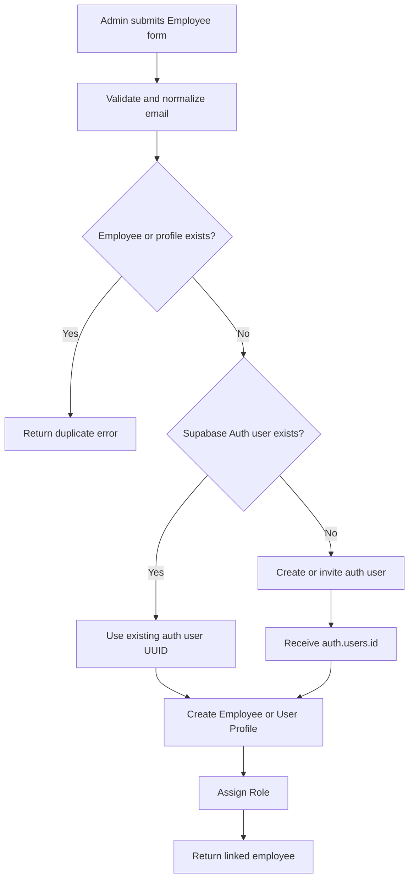

# Phase 17 — Employee Auth Linking & Permission Localization

## Objective

แก้ Employee creation flow ให้เชื่อมกับ Supabase Auth User
และบันทึก `auth.users.id` ลงในระบบโดยอัตโนมัติ

เพิ่มภาษาไทยกำกับ Permission ทุกตัว
โดยไม่เปลี่ยน Permission Code และ authorization behavior เดิม

---

## Working Rules

1. อ่านตามลำดับ:
   - `AGENTS.md`
   - `docs/CURRENT_TASK.md`
   - ไฟล์นี้
   - Source ที่เกี่ยวข้องกับ Task เท่านั้น

2. ใช้ targeted search ก่อน repository-wide scan

3. ทำงานภายใน Task ต่อเนื่องโดยไม่ต้องขอ approval ระหว่างขั้นตอน

4. ห้ามแก้ Phase 16 ที่ผ่าน verification แล้ว
   เว้นแต่ Phase 17 ทำให้เกิด regression โดยตรง

5. ห้าม speculative refactor

6. ห้ามสร้าง Signup flow ชุดที่สอง
   ถ้า Signup helper เดิมสามารถนำมาใช้ร่วมกันได้
   (**ผล Audit 17.1:** ไม่มี Signup helper ในแอป — ต้องออกแบบ Auth provisioning ใหม่ภายใต้ approval ของ Task ถัดไปหากกระทบ architecture)

---

## Target Employee Creation Flow

---

## Tasks

**Phase 17 progress:** Task 17.4 `COMPLETED` — **Phase 17 COMPLETED**

### Task 17.1 — Employee, Signup and Permission Audit

สถานะ: COMPLETED

### Task 17.2 — Employee and Supabase Auth UUID Linking

สถานะ: COMPLETED

**Delivered:**
- `SUPABASE_SERVICE_ROLE_KEY` + `lib/supabase/admin.ts` (server-only find/create Auth user)
- Migration `20260712223000_add_employee_email` (`employees.email` unique nullable)
- `POST/PATCH /api/employees` รับ email → resolve Auth UUID → เขียน `authUserId`
- UI `EmployeesManager` ใช้ email แทนการวาง UUID ด้วยมือ
- Verification: unit employees-validation, tsc, lint, auth-api-coverage / rbac-policy

### Task 17.3 — Permission Thai Localization

สถานะ: COMPLETED

**Delivered:**
- `lib/auth/permission-labels.ts` — ชื่อไทยครบ 23 codes
- Migration `20260712224000_localize_permission_descriptions` อัปเดต `permissions.description`
- `RolesManager` แสดงชื่อไทยเป็นหลัก + code เป็นรอง
- `serializePermission` fallback จาก label map
- Verification: unit permission-labels, rbac-policy, tsc

### Task 17.4 — Phase 17 Integration Verification

สถานะ: COMPLETED

**Evidence:**
- `npm run test:ci` PASSED (typecheck, lint, unit 62, build)
- Auth/RBAC E2E **91 passed** (2 skipped)
- `npx tsx scripts/rbac-preflight.ts` PASSED (roles 6, permissions 23, matrix 68, employees 8)

---

## Audit Results (Task 17.1)

**Audited:** 2026-07-12  
**Method:** targeted search + read ของ Employee CRUD, login/auth clients, schema, permission vocabulary, Role permission UI  
**Constraint:** ไม่แก้ UI / API / schema / migration / Permission Code

### 1) Employee creation flow ปัจจุบัน

| Step | Evidence |
|------|----------|
| UI | `components/settings/EmployeesManager.tsx` ใน `/settings` |
| API | `POST /api/employees`, `PATCH /api/employees/[employeeId]` |
| Permission | `employee.manage` (middleware `apiPermissionRules`) |
| Fields ที่รับ | `name` (บังคับ), `phone?`, `roleId?`, `authUserId?`, `isActive?` (update) |
| Auth linking | **มือ:** แอดมินวาง UUID จาก Supabase Dashboard ในช่อง Auth User ID |
| Role assign | เลือก `roleId` จาก `/api/roles` (ต้องมี `authorization.manage` ด้วย — ADMIN มีทั้งคู่) |
| Soft-disable | `isActive` ผ่าน PATCH + ปุ่มเปิด/ปิด |

ข้อความใน UI ยืนยันชัด: *สร้าง Auth user ที่ Supabase ก่อน แล้วนำ UUID มาผูก* และ *ยังไม่รองรับ invite จากแอป*

ไม่มีหน้า `/signup` และไม่มี Server Action สำหรับสมัครสมาชิกพนักงาน

### 2) Signup flow ปัจจุบัน

| Item | Evidence |
|------|----------|
| Signup page | **ไม่มี** (`app/signup` ไม่พบ) |
| `signUp` / invite API ในแอป | **ไม่มี** |
| Login เท่านั้น | `app/login/actions.ts` → `supabase.auth.signInWithPassword` |
| Post-login gate | ต้องมี `Employee` ที่ `authUserId = user.id` และ `isActive` |
| Auth clients | `lib/supabase/server.ts`, `client.ts`, `middleware.ts` — ใช้ **publishable key** เท่านั้น |
| Admin / service role client | **ไม่มี** |
| `.env.example` | มีแค่ `NEXT_PUBLIC_SUPABASE_URL` + `NEXT_PUBLIC_SUPABASE_PUBLISHABLE_KEY` — ไม่มี service role |

**สรุป:** ไม่มี Signup flow ในแอปให้ reuse — Auth users ถูกสร้างนอกแอป (Supabase Dashboard / manual) ตาม docs fixture เดิม

### 3) ตารางและ field ที่เก็บ Supabase UUID

| Location | Field | Notes |
|----------|-------|-------|
| `employees.auth_user_id` | `Employee.authUserId` | `Uuid?` `@unique` — **destination หลัก** ของ Auth UUID |
| ไม่มี model `User` / User Profile ใน Prisma | — | Identity = Supabase Auth; app profile = `Employee` |
| `audit_logs.actor_auth_user_id` | actor only | ไม่ใช่ mapping พนักงาน |
| Session claims | `claims.sub` | middleware ใช้หา Employee |

**ไม่มี** `email` บน `Employee` — ไม่สามารถค้นหาพนักงานด้วยอีเมลจาก schema ปัจจุบัน

### 4) วิธีค้นหา Auth User เดิม

**ในแอปตอนนี้:** ไม่มี — แอดมินต้องรู้ UUID เอง

ทางที่เป็นไปได้สำหรับ Task ถัดไป (ยังไม่ implement):

- Supabase Admin API `listUsers` / get by email (ต้อง service role)
- รับ email จากฟอร์ม แล้วค้นใน Auth ก่อนสร้าง

ค้นใน DB แอป: ได้เฉพาะ `prisma.employee.findUnique({ where: { authUserId } })` หลังมี UUID แล้ว

### 5) วิธีสร้าง Auth User ใหม่

**ปัจจุบัน:** นอกแอป — Supabase Dashboard > Authentication > Users > Add user (ดู `docs/reference/RBAC_TEST_USERS_SETUP.md` / archive)

**ในแอป:** ไม่มี `auth.admin.createUser` / `inviteUserByEmail`

สำหรับ Target flow ของ Phase 17 ต้องเพิ่ม Admin client + secret ฝั่งเซิร์ฟเวอร์ (ไม่ใช่ publishable key) — **กระทบ secret boundary** → ขอ approval ใน Task implement หากถือว่าเปลี่ยน auth architecture

### 6) วิธี Assign Role

- Single Role: `Employee.roleId` → `roles.id`
- Create/Update ผ่าน Employees API; ตรวจ role มีอยู่และ `isActive`
- Permission ของ role มาจาก `role_permissions` (DB) ตอน runtime
- แยกจาก Role-Permission editor (`authorization.manage`) ใน `RolesManager`

### 7) จุดที่ต้องแก้ (สำหรับงานถัดไป — ยังไม่แก้ใน 17.1)

1. Employee form: รับ **email** (และอาจ password/invite mode) แทนการวาง UUID ด้วยมือ
2. Server: lookup / create Auth user → ได้ `auth.users.id` → เขียน `Employee.authUserId`
3. เพิ่ม Supabase **Admin** client + env service role (server-only)
4. กลยุทธ์ duplicate: email ซ้ำใน Auth, `authUserId` ซ้ำใน Employee (มี P2002 อยู่แล้ว)
5. Permission localization: เติม `permissions.description` (หรือ label map) เป็นภาษาไทย — **ไม่เปลี่ยน `code`**
6. Role permission UI แสดงชื่อไทยแทน/คู่กับ code

### 8) Migration ที่จำเป็น (ยังไม่สร้างใน Task 17.1)

| Need | Migration? | หมายเหตุ |
|------|------------|----------|
| Thai permission labels | **อาจไม่ต้อง** ถ้าอัปเดต `permissions.description` ด้วย data migration/SQL seed | หรือ migration ที่ UPDATE description อย่างเดียว — ไม่เปลี่ยน code |
| `employees.email` | **น่าจะต้อง** ถ้าต้องการ unique email ในแอปและตรวจซ้ำก่อนเรียก Auth | หรือเก็บแค่ใน Auth ไม่มีใน Employee (lookup ด้วย Admin API อย่างเดียว) |
| Auth admin secret | ไม่ใช่ Prisma migration | env + code เท่านั้น |
| Multiple roles / User Profile table | **ไม่จำเป็น** ตาม schema ปัจจุบัน | Single Role + Employee เพียงพอ |

### 9) Failure and recovery risks

| Risk | Impact | Recovery ที่เข้ากับระบบเดิม |
|------|--------|------------------------------|
| สร้าง Auth user สำเร็จ แต่สร้าง Employee ล้ม | orphan Auth user | เก็บ auth UUID ใน error log (ไม่โชว์ secret); retry สร้าง Employee ด้วย UUID เดิม หรือลบ Auth user ด้วย Admin (destructive — ขอ approval) |
| สร้าง Employee ก่อนมี Auth | พนักงานเข้าไม่ได้ | สถานะปัจจุบันรองรับ `authUserId=null`; ผูกทีหลังด้วย PATCH |
| Auth email ซ้ำ (user มีอยู่แล้ว) | สร้างใหม่ไม่ได้ | reuse UUID ของ user เดิม แล้วผูก Employee (Target flow ข้อ E→F) |
| `authUserId` ซ้ำกับ Employee อื่น | P2002 อยู่แล้ว | คืน validation error — ไม่ overwrite |
| ปิด `isActive` / ถอด mapping | เข้าไม่ได้ตาม Phase 16 | เปิดใช้งาน / ผูกใหม่ — ไม่ต้องสร้าง Auth ใหม่ |
| ไม่มี service role / ใช้ผิดฝั่ง client | รั่ว secret | Admin client เฉพาะ Route Handler / server; ห้าม bundling เข้า Client |
| Signup helper ไม่มีให้ reuse | สร้าง flow ใหม่เสี่ยงซ้อน Auth | ออกแบบ **หนึ่ง** provisioning path บน Admin API ไม่สร้าง public signup สำหรับพนักงาน |

### 10) Permission Codes ที่มีอยู่จริงทั้งหมด

แหล่งความจริงที่สอดคล้องกัน:

- `lib/auth/authorization.ts` → `permissions` const (23 รายการ)
- DB seed `prisma/migrations/20260712070648_relational_rbac_v2` (23 codes, `description` ว่างตอน seed)
- Runtime catalog: `GET /api/permissions` อ่านจากตาราง `permissions`
- `scripts/rbac-preflight.ts` คาด `permissionCount === 23`

### 11) ชื่อภาษาไทยที่เสนอสำหรับแต่ละ Permission

> ข้อเสนอสำหรับ localization ใน Task ถัดไป — **ไม่เปลี่ยน Permission Code**

| Permission Code | ชื่อภาษาไทย (เสนอ) |
|-----------------|-------------------|
| `booking.read` | ดูการจอง |
| `booking.write` | สร้างและแก้ไขการจอง |
| `booking.lifecycle` | เปลี่ยนสถานะการจอง |
| `resource.read` | ดูห้องและแพ |
| `resource.manage` | จัดการห้องและแพ |
| `order.read` | ดูออเดอร์อาหาร |
| `order.write` | สั่งอาหาร |
| `order.kitchen` | ดำเนินงานครัว |
| `payment.read` | ดูการชำระเงิน |
| `payment.collect` | รับชำระเงิน |
| `payment.refund` | คืนเงิน |
| `payment_channel.manage` | จัดการช่องทางรับชำระ |
| `inspection.read` | ดูรายการตรวจห้อง |
| `inspection.write` | บันทึกการตรวจห้อง |
| `inspection.complete` | ปิดงานตรวจห้อง |
| `catalog.read` | ดูสินค้าและรายการตรวจ |
| `catalog.manage` | จัดการสินค้าและรายการตรวจ |
| `employee.read` | ดูข้อมูลและตารางพนักงาน |
| `employee.manage` | จัดการพนักงาน |
| `wage.read` | ดูค่าแรง |
| `report.read` | ดูรายงานและแดชบอร์ด |
| `settings.manage` | จัดการข้อมูลหลัก |
| `authorization.manage` | จัดการบทบาทและสิทธิ์ |

**UI ปัจจุบัน:** `RolesManager` แสดง `permission.code` และ `permission.description` ถ้ามี — description ใน DB ส่วนใหญ่ยังว่าง → เหมาะกับการใส่ชื่อไทยใน `description` โดยไม่แตะ code

### 12) Implementation order จากโค้ดจริง

1. **Task 17.2 — Employee ↔ Auth UUID linking**  
   - ออกแบบ: email → find-or-create Auth user → ตั้ง `Employee.authUserId`  
   - ต้องมี Admin client (ไม่มี Signup ให้ reuse) → ขอ approval หากถือว่าเปลี่ยน auth architecture / เพิ่ม service role  
   - คง Single Role ผ่าน `roleId` ที่มีอยู่
2. **Permission Thai labels**  
   - อัปเดต `permissions.description` (หรือ label helper) ตามตารางด้านบน  
   - แสดงใน Role permission UI — ไม่เปลี่ยน matrix / codes
3. **Verification**  
   - Employees CRUD + login mapping + rbac-preflight + auth/RBAC E2E  
   - ห้าม regression Phase 16

### ไฟล์ที่เกี่ยวข้อง (อ่านจริงใน Audit)

- `components/settings/EmployeesManager.tsx`
- `app/api/employees/route.ts`, `app/api/employees/[employeeId]/route.ts`
- `lib/settings/employees.ts`, `employees-shared.ts`
- `app/login/actions.ts`, `app/login/LoginForm.tsx`
- `lib/supabase/server.ts`, `config.ts`, `middleware.ts`
- `lib/auth/employee-authorization.ts`, `authorization.ts`, `authorization-server.ts`
- `prisma/schema.prisma` (`Employee`, `Role`, `Permission`)
- `app/api/permissions/route.ts`
- `components/settings/RolesManager.tsx` (permission checkboxes)
- `prisma/migrations/20260712070648_relational_rbac_v2/migration.sql`
- `.env.example`
